# 🌱 Let's Get Building

## ⬇️ Access and Setup

### 🌐 Viewing the Live Site (GitHub Pages)

The website is hosted live using GitHub Pages. You can view the fully responsive, functioning site immediately by clicking this link:

[**View Live Project Here**](https://ifelseread.github.io/letsgetbuilding/index.html)

---

## 🌟 Introduction: Let's Get Building

This repository contains the source code for **Let's Get Building**, a static front-end web application designed as an educational resource for aspiring developers.

### Purpose and Value

The core purpose of **Let's Get Building** is to introduce visitors to the **full web development journey**—from the initial idea and coding through to final testing and cloud deployment.

The site provides immense educational value by serving as both a guide and a technical demonstration:

* **Educational Resource:** It guides users through the typical stages of project development and demonstrates how to build a robust site based solely on foundational technologies.
* **Technical Showcase:** The project emphasizes **clean design** and adherence to best practices, utilizing **semantic HTML** and efficient **CSS** to achieve full functionality **without the use of JavaScript**.
* **Best Practices:** The application provides a clear solution to user story demands by modeling the principles of strong **User Experience (UX)** design, including accessibility.

### Design and Technology Focus

The entire development process adhered to high standards for front-end implementation:

* **Structure and Accessibility:** The layout is structured using **semantic markup** to ensure the code meets modern accessibility guidelines and promotes clarity.
* **Responsivity:** The design incorporates **CSS media queries** to guarantee the layout adapts appropriately and maintains its structural integrity across all device screen sizes.

---

## 💻 Accessing the Source Code

The project's source code is hosted publicly on GitHub. You can obtain the code using two primary methods:

### 1. Cloning the Repository (Recommended for Developers)

Cloning creates a full copy of the repository, including the entire Git history, allowing for version control and contributions.

1.  **Copy the Clone URL:** On the main repository page (https://github.com/ifElseRead/letsgetbuilding/), click the **`< > Code`** button and copy the HTTPS URL: `https://github.com/ifElseRead/letsgetbuilding.git`
2.  **Use the Terminal:** Open your terminal or command prompt.
3.  **Clone:** Execute the `git clone` command (Note: Incorrect link formatting is removed):
    ```bash
    git clone [https://github.com/ifElseRead/letsgetbuilding.git](https://github.com/ifElseRead/letsgetbuilding.git)
    ```
4.  **Navigate:** Change into the new project directory:
    ```bash
    cd letsgetbuilding
    ```

### 2. Downloading the Source Files (Recommended for General Users)

This method provides a snapshot of the current code without the Git history, ideal for viewing or non-version-controlled use.

1.  Navigate to the main repository page on GitHub.
2.  Click the **`< > Code`** button.
3.  Select **`Download ZIP`** from the dropdown menu.
4.  Unzip the file on your local machine to access the project files.

---

## 🚀 Deployment Procedure

This section outlines the steps taken to deploy and host the final static website on a cloud-based platform, addressing the documentation omission. The project was successfully deployed using **GitHub Pages**.

### Prerequisites

* The project files committed and pushed to a GitHub repository.

### Steps for Deployment

1.  **Repository Setup:** Ensure the latest, clean code is pushed to the `main` branch of the GitHub repository.
2.  **Access Settings:** Navigate to the **Settings** tab of the GitHub repository.
3.  **Select Pages:** In the left-hand menu, select the **Pages** option.
4.  **Configure Source:** Under the "Build and deployment" section, set the **Source** to **Deploy from a branch**.
5.  **Set Branch:** Select the `main` branch from the drop-down menu and choose the `/ (root)` folder.
6.  **Save Changes:** Click the **Save** button.
7.  **Verification:** GitHub Pages automatically initiates the build and deployment process. The live URL will appear at the top of the Pages settings page once deployment is complete.
8.  **Final Check:** The deployed version was manually tested to ensure it matches the development version, confirming all links and functionality work correctly in the live environment.

### Live Site Link

The final deployed project can be viewed here: [https://ifelseread.github.io/letsgetbuilding/](https://ifelseread.github.io/letsgetbuilding/)

---

## 🚀 Project Overview

The primary goal of this project is to showcase a **HTML and CSS-only** frontend approach. The site allows visitors to explore how modern websites are structured and styled while adhering to current best practices for responsiveness and usability.

---

## 🎯 Core Objectives

* Build a **fully responsive** static website.
* Design a layout that clearly guides users through the web development process flow.
* Provide logical navigation between all key sections: Home, About, Contact, Success, and a Custom 404 page.

---

## 🧩 Key Features

* **Mobile-First Design:** Implemented using modern **CSS Flexbox and Grid** techniques.
* **Accessible Navigation:** Clear active states and focus indicators for usability.
* **Process Flow:** A dedicated visual section outlining the stages: _Idea → Code → Testing → Deployment_.
* **Contact Form:** An interactive form with a confirmation Success page.
* **Location:** An **About section** featuring an embedded Google Map and contact details.
* **SEO Ready:** Includes essential meta data and SEO tags for improved search visibility.
* **Error Handling:** A **custom 404 page** to maintain design consistency.

---

## 🧱 User Stories

These stories capture the site's requirements from two crucial perspectives: the **Visitor** (end-user) and the **Site Owner / Developer** (creator).

---

### 👤 As a Visitor

* I want to understand the site's purpose right away so I can quickly decide if it's relevant without scrolling.
* I want to learn the web development steps (idea → code → testing → deployment) in a simple visual way so I can clearly see the whole process.
* I want the navigation menu to be easy to find and use so I can move between sections easily, even on my phone.
* I want the website to look clean and modern so it feels professional and engaging.
* I want the layout to adjust nicely on my phone so I can view everything comfortably without zooming or sideways scrolling.
* I want to contact the creator using a simple form so I can ask questions or discuss web development.
* I want to see social links in the footer so I can easily find the creator’s profiles.
* I want to know who made the site so I feel connected and can explore more of their work if I like it.

---

### 🧑‍💻 As the Site Owner / Developer

* I want to demonstrate user-centred design skills so I meet the project criteria and showcase best practices.
* I want the site to load fast and function without JavaScript so it's accessible and lightweight.
* I want to document my design and problem-solving process so I can use it in my project report and portfolio.
* I want an expandable structure so I can easily add more sections or interactivity in the future.
* I want the visuals (like the process boxes) to look good and remain fully responsive so the design effectively represents my skills.
* I want the contact form to validate properly so users are immediately notified when they've missed a required field.
* I want to thoroughly test the website across devices and browsers so I can ensure consistent display and functionality everywhere.

### 🖼️ Wireframes

Here are the initial wireframes showing the mobile-first approach and key layouts.

#### Home Page


#### About & Contact Page


---

## 🛠️ Site Features

The **Let's Get Building** project was developed to showcase modern, accessible, and functional front-end design achieved using only HTML and CSS.

### Core Features

* **Responsive Design:** The entire layout utilizes CSS media queries to ensure a consistent, readable, and fully functional user experience across all devices, including mobile, tablet, and desktop screens.
* **Semantic HTML5:** All markup is structured using modern semantic tags (e.g., `<header>`, `<nav>`, `<main>`, `<section>`) to improve search engine optimization (SEO) and ensure screen readers can easily interpret the page structure.
* **No JavaScript:** The project achieves all functionality, including interactive elements, solely through HTML and CSS, demonstrating the power of these foundational languages.

### The Responsive Navigation Hack

A key technical feature is the clean, collapsible navigation menu, which is powered by a common CSS technique known as the **Checkbox Hack**—used here to meet the project's constraint of using no JavaScript:

1.  **Invisible Control:** An invisible `<input type="checkbox">` element is placed in the HTML.
2.  **Visible Trigger:** A visible `<label>` element is used as the interactive **menu icon** (often the "hamburger" icon) that visually toggles the menu. Tapping this label changes the state of the associated checkbox.
3.  **CSS Logic (State-Driven Display):** CSS rules target the navigation menu using the adjacent sibling combinator (`+`) and the `:checked` pseudo-class. When the checkbox's state is `:checked` (meaning the icon has been tapped), the CSS displays the navigation menu.
4.  **Result:** This technique delivers a fully functional, collapsible menu on mobile devices while avoiding any reliance on JavaScript.


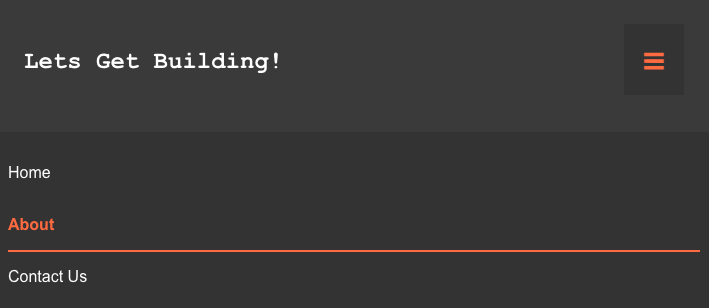

---

## 🧪 Testing Documentation

### 1. Code Validation Reports

The custom HTML and CSS code must pass through official W3C validation tools without any errors or warnings. This verifies compliance with accessibility and structural standards.

| Code | Validator Used | Status | Report Evidence |
| :--- | :--- | :--- | :--- |
| **HTML** | W3C Markup Validation Service | **PASS** | 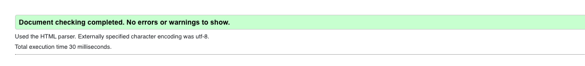 |
| **CSS** | W3C Jigsaw CSS Validator | **PASS** | 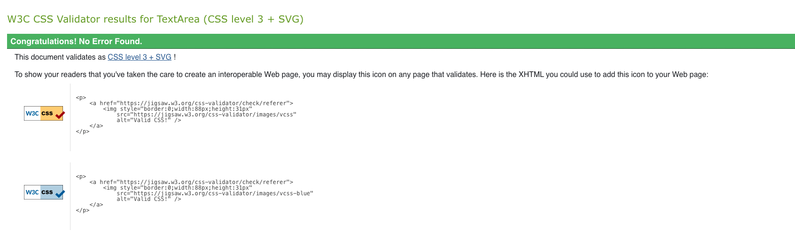 |

---

### 2. Performance Testing (Lighthouse)

Performance testing was conducted using **Google Lighthouse** to assess and ensure the application provides a fast, accessible, and high-quality user experience.

| Page Tested | Lighthouse Score Image |
| :---: | :---: |
| **Index.html** | 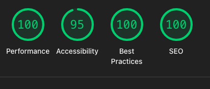 |
| **AboutUs.html** | 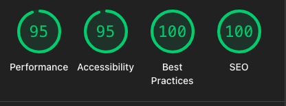 |
| **Contact.html** | 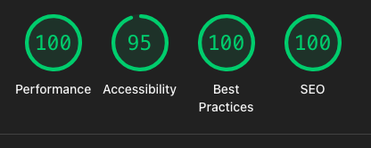 |
| **Contact Success** |  |
| **404 page** | 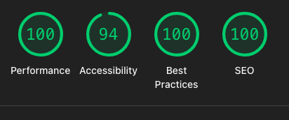 |

#### Screenshot Evidence

The following screenshots align with the tests above, providing visual context for the page structure and functionality:

##### Index.html Screenshots
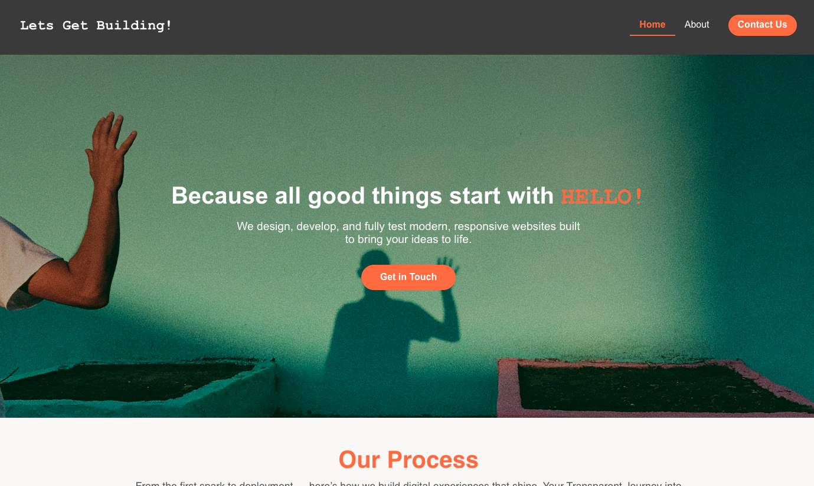

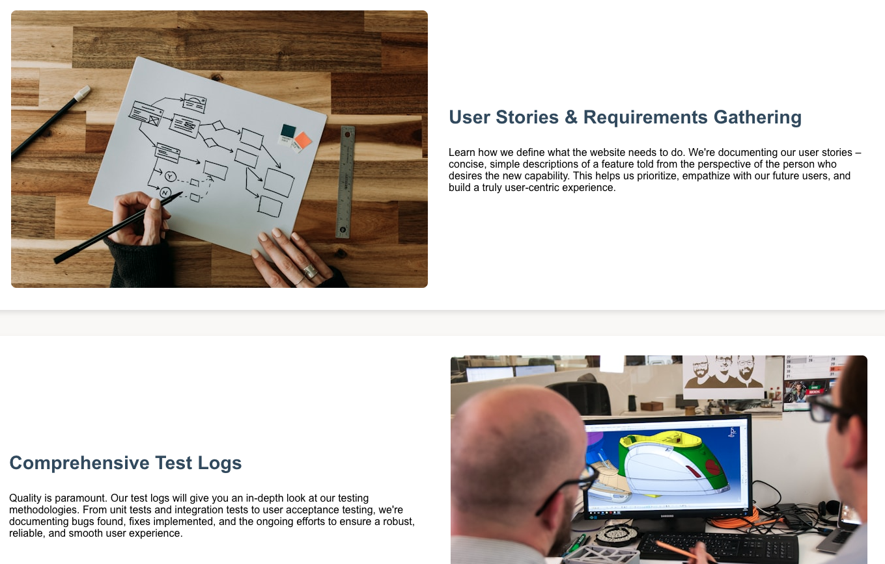
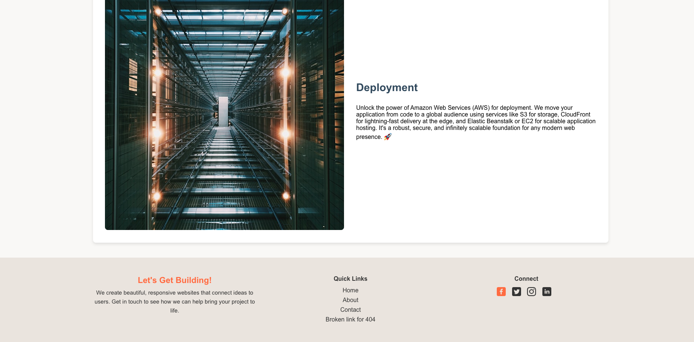

##### Contact Page & Validation Screenshots
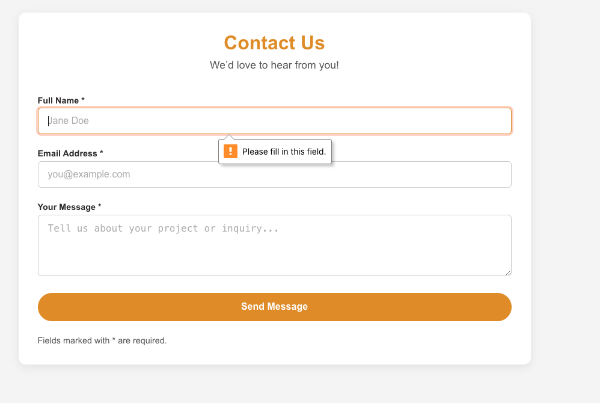
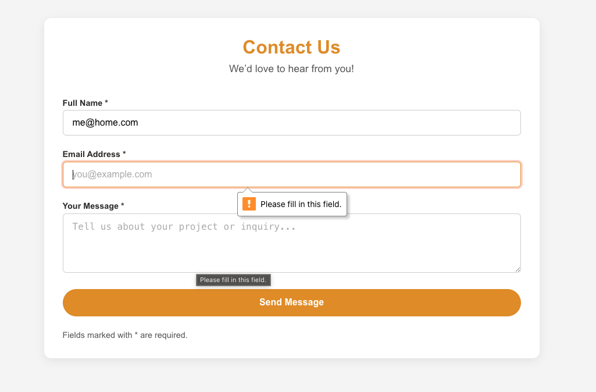
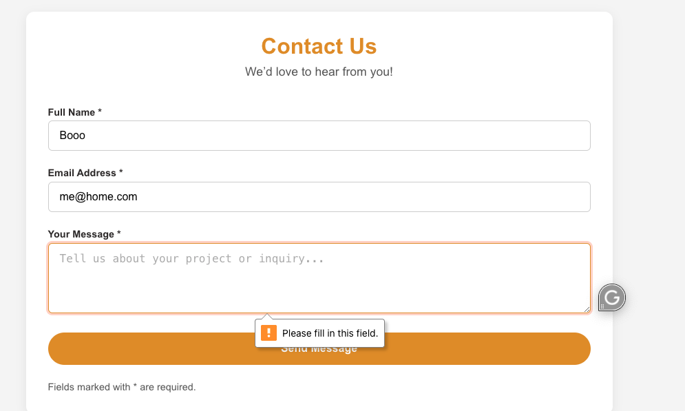
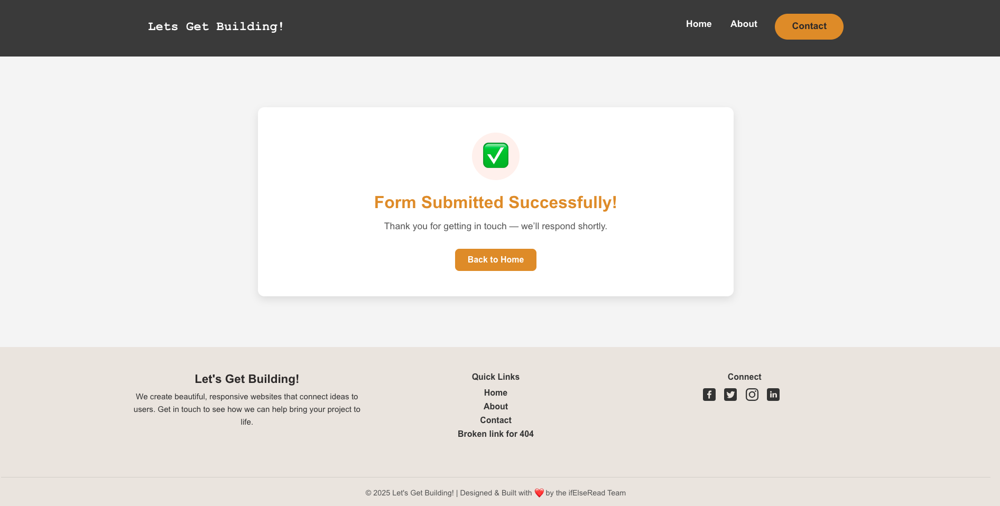

##### About Us Page
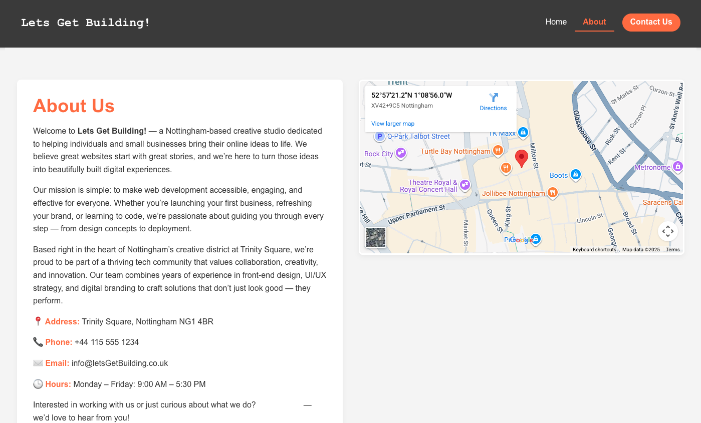

#### Custmo 404 Error Page
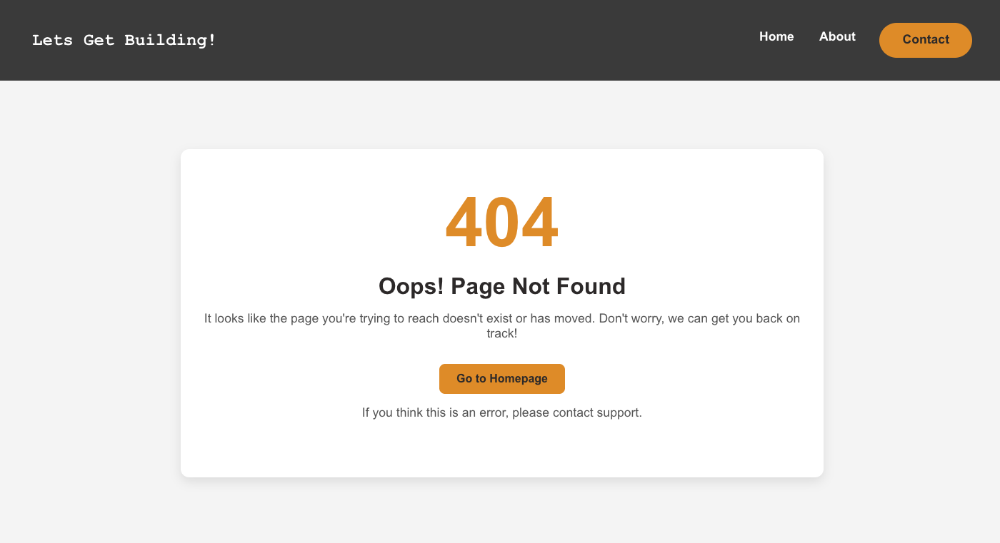

#### Key Findings

The site achieved high scores across all categories, but there was an issue with the contrast on the color scheme. I retained the original branding colors despite this, as they are integral to the project's visual identity.

---

### 3. Manual Testing and Bug Evaluation

This section documents the testing performed on the site's responsiveness, core functionality, and bug evaluation.

**Responsiveness Testing**

| Device Tested | Viewport Width (px) | Expected Result | Status |
| :--- | :--- | :--- | :--- |
| **Mobile** (Small) | 320px - 480px | Layout collapses to a single column; navigation menu stacks or uses hamburger icon. | Pass |
| **Tablet** (Medium) | 768px - 1024px | Layout adapts with multi-column display; images scale appropriately. | Pass |
| **Desktop** (Large) | 1200px+ | Full-width design with maximum content display; no horizontal scroll. | Pass |

**Link and Navigation Testing**

| Page / Element | Link Destination | Opens in New Tab? | Status |
| :--- | :--- | :--- | :--- |
| Home Page - Logo | Home (`index.html`) | No (Internal) | Pass |
| Navigation - Contact | Contact Page (`contact.html`) | No (Internal) | Pass |
| Social in Footer | Creator's GitHub Profile (External URL) | **Yes** (`target="_blank"`) | Pass |
| Process Flow | Idea Section ID (`#idea-section`) | No (Internal) | Pass |
| Contact Form Submit | Success Page (`success.html`) | No (Internal) | Pass |
| Contact Success page | Google Maps Location (External URL) | No (Internal) | Pass |
| About Page - Map Link | Google Maps Location (External URL) | No (Internal) | Pass |

**Issue Log and Fixes**

| Page / Element | Issue | Solution | Status |
| :--- | :--- | :--- | :--- |
| SVG icons in Footer on all pages | Hover wouldn't work or change colour | FIX: Added `fill` to the SVG with the value of `currentColor`. | Pass |

#### 📝 Note on New Tabs

To ensure an external link opens in a new tab, the HTML code for the anchor tag must include the attribute `target="_blank"`, for example: `<a href="external-link" target="_blank">...</a>`.

---

## 🏗️ Technologies Used

| Technology | Purpose |
| :--- | :--- |
| **HTML5** | Core structure and semantic markup. |
| **CSS3** | Complete styling and responsive layout rules. |
| **Flexbox & Grid** | Advanced page structure and alignment. |
| **Google Maps** | Embedded map for displaying location. |
| **Unsplash** | High-quality, free-to-use visuals. |

---

## 📚 Implementation References

The following external resources and techniques were integral to the project's development, specifically for achieving core functionality without relying on JavaScript:

* **Responsive Menu (CSS Checkbox Hack):** The pure CSS navigation toggle was implemented using the "checkbox hack" technique.
    * [CSS-Tricks: The Checkbox Hack](https://css-tricks.com/the-checkbox-hack/)
* **SVG Icons:** Icons used throughout the site were sourced and customized from this library.
    * [iconsvg.xyz](https://iconsvg.xyz/)

---

## 🤖 AI Assistance

To streamline the content creation process and focus development efforts on structure and design, **Generative AI** was utilized for drafting the preliminary text across all pages.

### How AI was Used

* **Initial Drafts:** AI was employed to generate the initial drafts of descriptive text for the Home, About, and Contact pages, as well as the meta descriptions and keywords.
* **Tone & Style:** The output was guided by prompts specifying a **professional, accessible, and educational** tone.
* **Editing:** All AI-generated content was thoroughly **reviewed, edited, and validated by the developer** to ensure accuracy, relevance to the project's objectives, and consistent brand voice.

This approach allowed for rapid prototyping of the site's content while maintaining final quality control by the site owner.
