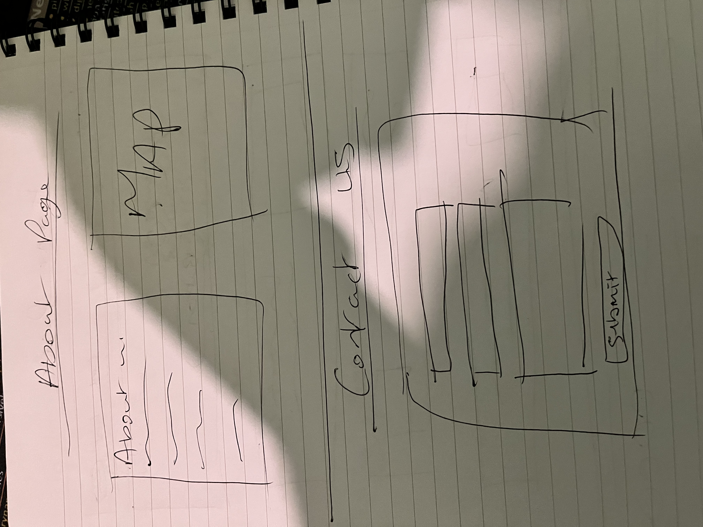

# 🌱 Let's Get Building

## ⬇️ Access and Setup

### 🌐 Viewing the Live Site (GitHub Pages)

The website is hosted live using GitHub Pages. You can view the fully responsive, functioning site immediately by clicking this link:

[**View Live Project Here**](https://ifelseread.github.io/letsgetbuilding/index.html)

**Let’s Get Building** is a responsive, educational website that introduces visitors to the full web development journey—from the initial idea and coding to final testing and deployment. This project emphasizes **clean design** and **semantic HTML & CSS**, achieving full functionality without using JavaScript.

---

## 🚀 Project Overview

The primary goal of this project is to showcase a **HTML and CSS-only** frontend approach. The site allows visitors to explore how modern websites are structured and styled while adhering to current best practices for responsiveness and usability.

---

## 🎯 Core Objectives

- Build a **fully responsive** static website.
- Design a layout that clearly guides users through the web development process flow.
- Provide logical navigation between all key sections: Home, About, Contact, Success, and a Custom 404 page.

---

## 🧩 Key Features

- **Mobile-First Design:** Implemented using modern **CSS Flexbox and Grid** techniques.
- **Accessible Navigation:** Clear active states and focus indicators for usability.
- **Process Flow:** A dedicated visual section outlining the stages: _Idea → Code → Testing → Deployment_.
- **Contact Form:** An interactive form with a confirmation Success page.
- **Location:** An **About section** featuring an embedded Google Map and contact details.
- **SEO Ready:** Includes essential meta data and SEO tags for improved search visibility.
- **Error Handling:** A **custom 404 page** to maintain design consistency.

---

## 🏗️ Technologies Used

| Technology         | Purpose                                       |
| :----------------- | :-------------------------------------------- |
| **HTML5**          | Core structure and semantic markup.           |
| **CSS3**           | Complete styling and responsive layout rules. |
| **Flexbox & Grid** | Advanced page structure and alignment.        |
| **Google Maps**    | Embedded map for displaying location.         |
| **Unsplash**       | High-quality, free-to-use visuals.            |

---

# 🧱 Let's Get Building — User Stories

These stories capture the site's requirements from two crucial perspectives: the **Visitor** (end-user) and the **Site Owner / Developer** (creator).

---

## 👤 As a Visitor

- I want to understand the site's purpose right away so I can quickly decide if it's relevant without scrolling.
- I want to learn the web development steps (idea → code → testing → deployment) in a simple visual way so I can clearly see the whole process.
- I want the navigation menu to be easy to find and use so I can move between sections easily, even on my phone.
- I want the website to look clean and modern so it feels professional and engaging.
- I want the layout to adjust nicely on my phone so I can view everything comfortably without zooming or sideways scrolling.
- I want to contact the creator using a simple form so I can ask questions or discuss web development.
- I want to see social links in the footer so I can easily find the creator’s profiles.
- I want to know who made the site so I feel connected and can explore more of their work if I like it.

---

## 🧑‍💻 As the Site Owner / Developer

- I want to demonstrate user-centred design skills so I meet the project criteria and showcase best practices.
- I want the site to load fast and function without JavaScript so it's accessible and lightweight.
- I want to document my design and problem-solving process so I can use it in my project report and portfolio.
- I want an expandable structure so I can easily add more sections or interactivity in the future.
- I want the visuals (like the process boxes) to look good and remain fully responsive so the design effectively represents my skills.
- I want the contact form to validate properly so users are immediately notified when they've missed a required field.
- I want to thoroughly test the website across devices and browsers so I can ensure consistent display and functionality everywhere.

### 🖼️ Wireframes

Here are the initial wireframes showing the mobile-first approach and key layouts.

#### Home Page

#### About & Contact Page

# ✅ Testing and Validation

This section documents the testing performed on the site's responsiveness and core functionality.

---

## 📱 Responsiveness Testing

The site was tested across several major viewport sizes to ensure a consistent, mobile-first experience. This testing confirmed the proper function of **CSS Flexbox** and **Grid** layouts.

| Device Tested       | Viewport Width (px) | Expected Result                                                                     | Status |
| :------------------ | :------------------ | :---------------------------------------------------------------------------------- | :----- |
| **Mobile** (Small)  | 320px - 480px       | Layout collapses to a single column; navigation menu stacks or uses hamburger icon. | Pass   |
| **Tablet** (Medium) | 768px - 1024px      | Layout adapts with multi-column display; images scale appropriately.                | Pass   |
| **Desktop** (Large) | 1200px+             | Full-width design with maximum content display; no horizontal scroll.               | Pass   |

---

## 🔗 Link and Navigation Testing

All internal and external links were tested to ensure they direct the user to the correct page. External links are configured to open in a new tab for a better user experience.

| Page / Element        | Link Destination                        | Opens in New Tab?           | Status |
| :-------------------- | :-------------------------------------- | :-------------------------- | :----- |
| Home Page - Logo      | Home (`index.html`)                     | No (Internal)               | Pass   |
| Navigation - Contact  | Contact Page (`contact.html`)           | No (Internal)               | Pass   |
| Social in Footer      | Creator's GitHub Profile (External URL) | **Yes** (`target="_blank"`) | Pass   |
| Process Flow          | Idea Section ID (`#idea-section`)       | No (Internal)               | Pass   |
| Contact Form Submit   | Success Page (`success.html`)           | No (Internal)               | Pass   |
| Contact Success page  | Google Maps Location (External URL)     | No (Internal)               | Pass   |
| About Page - Map Link | Google Maps Location (External URL)     | No (Internal)               | Pass   |

---

## 🔗 Issue with sections of the website

| Page / Element                  | Issue                                | Solution                                                 | Status |
| :------------------------------ | :----------------------------------- | :------------------------------------------------------- | :----- |
| SVG icons inFooter on all pages | Hover wouldn't work or change colour | FIX add fill to the SVG with the value of > currentColor | Pass   |

### 📝 Note on New Tabs

To ensure an external link opens in a new tab, the HTML code for the anchor tag must include the attribute `target="_blank"`, for example: `<a href="external-link" target="_blank">...</a>`.

---

## 📚 Implementation References

The following external resources and techniques were integral to the project's development, specifically for achieving core functionality without relying on JavaScript:

- **Responsive Menu (CSS Checkbox Hack):** The pure CSS navigation toggle was implemented using the "checkbox hack" technique.
  - [CSS-Tricks: The Checkbox Hack](https://css-tricks.com/the-checkbox-hack/)

* **SVG Icons:** Icons used throughout the site were sourced and customized from this library.
  - [iconsvg.xyz](https://iconsvg.xyz/)

---

## 🤖 AI Assistance

To streamline the content creation process and focus development efforts on structure and design, **Generative AI** was utilized for drafting the preliminary text across all pages.

### How AI was Used

- **Initial Drafts:** AI was employed to generate the initial drafts of descriptive text for the Home, About, and Contact pages, as well as the meta descriptions and keywords.
- **Tone & Style:** The output was guided by prompts specifying a **professional, accessible, and educational** tone.
- **Editing:** All AI-generated content was thoroughly **reviewed, edited, and validated by the developer** to ensure accuracy, relevance to the project's objectives, and consistent brand voice.

This approach allowed for rapid prototyping of the site's content while maintaining final quality control by the site owner.

---

    

            
Valid CSS!

    

